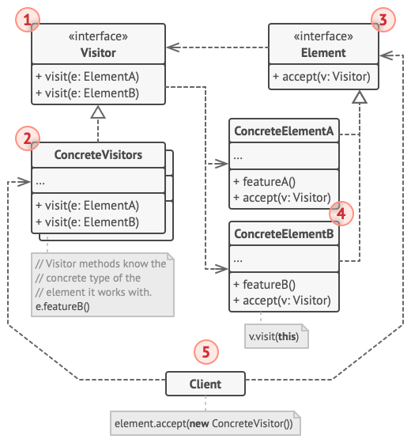

# Design Patterns

## Creational Patterns

Creational design patterns provide various object creation mechanisms, which increase flexibility and reuse of existing code.

### Factory Method

### Abstract Factory

### Builder

### Prototype

### Singleton

## Structual Patterns

Structural design patterns explain how to assemble objects and classes into larger structures, while keeping these structures flexible and efficient.

### Adapter

### Bridge

### Composite

### Decorator

### Facade

### Flyweight

### Proxoy

## Behavioral Patterns

Behavioral design patterns are concerned with algorithms and the assignment of responsibilities between objects.

### Chains of Responsibility

### Command

Command is a behavioral design pattern that turns a request into a stand-alone object that contains all information about the request. This transformation can pass requests as a method arguments, delay or queue a request’s execution, and support undoable operations.


1. The **Sender** class (aka invoker) is responsible for initiating requests. This class must have a field for storing a reference to a command object. The sender triggers that command instead of sending the request directly to the receiver. Note that the sender isn’t responsible for creating the command object. Usually, it gets a pre-created command from the client via the constructor.

2. The **Command** interface usually declares just a single method for executing the command.

3. **Concrete Commands** implement various kinds of requests. A concrete command isn’t supposed to perform the work on its own, but rather to pass the call to one of the business logic objects. However, for the sake of simplifying the code, these classes can be merged.
Parameters required to execute a method on a receiving object can be declared as fields in the concrete command. You can make command objects immutable by only allowing the initialization of these fields via the constructor.

4. The **Receiver** class contains some business logic. Almost any object may act as a receiver. Most commands only handle the details of how a request is passed to the receiver, while the receiver itself does the actual work.

5. The **Client** creates and configures concrete command objects. The client must pass all of the request parameters, including a receiver instance, into the command’s constructor. After that, the resulting command may be associated with one or multiple senders.

```cpp
class Receiver {
 public:
  void Operation(int a, int b, int c) {
    // The Receiver classes contain some important business logic.
    // They know how to perform all kinds of operations, associated with carrying out a request.
  }
};

// The Command interface declares a method for executing a command.
class Command {
 public:
  virtual ~Command() {}

  virtual void Execute() = 0;
};

class ConcreteCommand: public Command {
 public:
  ConcreteCommand(Receiver* receiver, int a, int b, int c)
    : receiver_(receiver), a_(a), b_(b), c_(c) {}
  virtual ~ConcreteCommand() {}

  // Delegate to methods of a receiver.
  virtual void Execute() {
    receiver_->Operation(a_, b_, c_);
  }

 private:
  Receiver* receiver_;
  int a_, b_, c_;
};

class Invoker {
 public:
  Invoker(): command_(nullptr) {}
  ~Invoker() {
    if (command_)
      delete command_;
  }

  void SetCommand(Command* command) {
    command_ = command;
  }

  void ExecuteCommand() {
    if (command_)
      command_->Execute();
  }

 private:
  Command* command_;
};

int main() {
  Receiver receiver;
  Invoker invoker;
  invoker.SetCommand(new ConcreteCommand(&receiver, 1, 2, 3));
  invoker.ExecuteCommand();
  return 0;
}
```

* Use the Command pattern to parametrize objects with operations.
* Use the Command pattern to queue operations, schedule their execution, or execute them remotely.
* Use the Command pattern to implement reversible operations.
* Chain of Responsibility, Command, Mediator and Observer address various ways of connecting senders and receivers of requests:
  * Chain of Responsibility passes a request sequentially along a dynamic chain of potential receivers until one of them handles it.
  * Command establishes unidirectional connections between senders and receivers.
  * Mediator eliminates direct connections between senders and receivers, forcing them to communicate indirectly via a mediator object.
  * Observer lets receivers dynamically subscribe to and unsubscribe from receiving requests.
* Command and Strategy may look similar because you can use both to parameterize an object with some action. However, they have very different intents.

### Iterator

### Mediator

Mediator is a behavioral design pattern that can reduce chaotic dependencies between objects. The pattern restricts direct communications between the objects and forces them to collaborate only via a mediator object.


1. **Components** are various classes that contain some business logic. Each component has a reference to a mediator, declared with the type of the mediator interface. The component isn’t aware of the actual class of the mediator, so you can reuse the component in other programs by linking it to a different mediator.

2. The **Mediator** interface declares methods of communication with components, which usually include just a single notification method. Components may pass any context as arguments of this method, including their own objects, but only in such a way that no coupling occurs between a receiving component and the sender’s class.

3. **Concrete Mediators** encapsulate relations between various components. Concrete mediators often keep references to all components they manage and sometimes even manage their lifecycle.

4. F must not be aware of other components. If something important happens within or to a component, it must only notify the mediator. When the mediator receives the notification, it can easily identify the sender, which might be just enough to decide what component should be triggered in return.
From a component’s perspective, it all looks like a total black box. The sender doesn’t know who’ll end up handling its request, and the receiver doesn’t know who sent the request in the first place.

```cpp
class Mediator;

class Component {
 protected:
  Mediator* mediator_;

 public:
  Component(): mediator_(nullptr) {}

  void SetMediator(Mediator* mediator) {
    mediator_ = mediator;
  }
};

class Mediator {
 public:
  virtual ~Mediator() {}
  virtual void Notify(Component*, char i) const = 0;
};

class ConcreteComponentA: public Component {
 public:
  virtual ~ConcreteComponentA() {}

  void Operator() {
    mediator_->Notify(this, 'A');
  }
};

class ConcreteComponentB: public Component {
 public:
  virtual ~ConcreteComponentB() {}

  void Operator() {
    mediator_->Notify(this, 'B');
  }
};

class ConcreteMediator: public Mediator {
 private:
  ConcreteComponentA* ca_;
  ConcreteComponentB* cb_;

 public:
  ConcreteMediator(ConcreteComponentA* ca, ConcreteComponentB* cb)
      : ca_(ca), cb_(cb) {}
  virtual ~ConcreteMediator() {}

  virtual void Notify(Component* c, char i) const {
    if (i == 'A') {
      std::cout << "Notify '" << i << "' from " << c << std::endl;
    }

    if (i == 'B') {
      std::cout << "Notify '" << i << "' from " << c << std::endl;
    }
  }
};

int main() {
  ConcreteComponentA ca;
  ConcreteComponentB cb;
  ConcreteMediator mediator(&ca, &cb);
  ca.SetMediator(&mediator);
  cb.etMediator(&mediator);
  ca.Operator();
  return 0;
}
```

* Use the Mediator pattern when it’s hard to change some of the classes because they are tightly coupled to a bunch of other classes.
* Use the pattern when can’t reuse a component in a different program because it’s too dependent on other components.
* Use the Mediator when creating tons of component subclasses just to reuse some basic behavior in various contexts.

### Memento

### Observer

### State

### Strategy

### Template Method

### Visitor

Visitor is a behavioral design pattern that can separate algorithms and operates from the objects.



1. The **Visitor** interface declares a set of visiting methods that can take concrete elements of an object structure as arguments. These methods may have the same names if the program is written in a language that supports overloading, but the type of their parameters must be different.

2. Each **Concrete Visitor** implements several versions of the same behaviors, tailored for different concrete element classes.

3. The **Element** interface declares a method for accepting visitors. This method should have one parameter declared with the type of the visitor interface.

4. Each **Concrete Element** must implement the acceptance method. The purpose of this method is to redirect the call to the proper visitor’s method corresponding to the current element class. Be aware that even if a base element class implements this method, all subclasses must still override this method in their own classes and call the appropriate method on the visitor object.

5. The **Client** usually represents a collection or some other complex object. Usually, clients aren’t aware of all the concrete element classes because they work with objects from that collection via some abstract interface.

```cpp
class ConcreteElementA;
class ConcreteElementB;

// The Visitor interface declares a set of visiting methods that
// correspond to element classes. The signature of a visiting
// method lets the visitor identify the exact class of the
// element that it's dealing with.
class Visitor {
 public:
  virtual ~Visitor() {}

  virtual void Visit(const ConcreteElementA*) const = 0;
  virtual void Visit(const ConcreteElementB*) const = 0;
};

class ConcreteVisitor: public Visitor {
 public:
  virtual ~ConcreteVisitor() {}

  virtual void Visit(const ConcreteElementA* element) const {
    // Visitor methods know the concrete type of the element
    // it works with.
    element->FeatureA();
  }

  virtual void Visit(const ConcreteElementB* element) const {
    element->FeatureB();
  }
};

// The element interface declares an `Accept` method that takes
// the base visitor interface as an argument.
class Element {
 public:
  virtual ~Element() {}
  virtual void Accept(const Visitor*) const = 0;
};

// Each concrete element class must implement the `Accept`
// method in such a way that it calls the visitor's method that
// corresponds to the element's class.
class ConcreteElementA: public Element {
 public:
  virtual ~ConcreteElementA() {}

  void FeatureA() const {}

  virtual void Accept(const Visitor* visitor) const {
    visitor->Visit(this);
  }
};

class ConcreteElementB: public Element {
 public:
  virtual ~ConcreteElementB() {}

  void FeatureB() const {}

  virtual void Accept(const Visitor* visitor) const {
    visitor->Visit(this);
  }
};
```

* Use the Visitor when need to perform an operation on all elements of a complex object structure (for example, an object tree).
* Use the Visitor to clean up the business logic of auxiliary behaviors.
* Use the pattern when a behavior makes sense only in some classes of a class hierarchy, but not in others.
* Visitor is a powerful version of the Command pattern. Its objects can execute operations over various objects of different classes.
