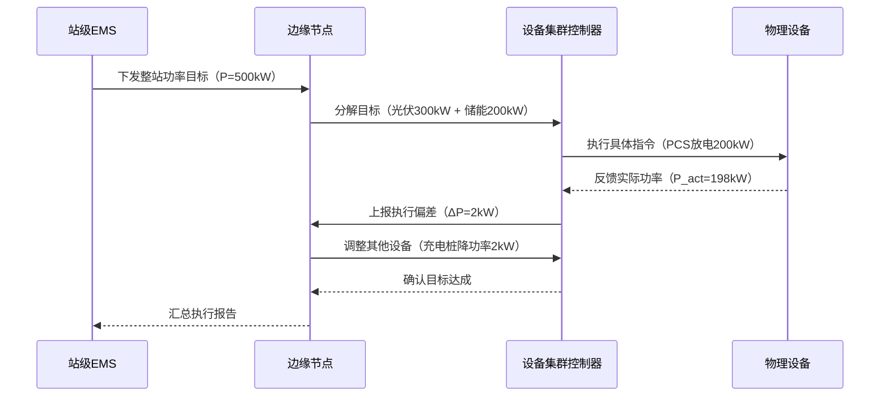

架构图

```
+======================================================================================================+
|                                      站级EMS (云端/中央控制层)                                         |
+======================================================================================================+
| 能源云平台                                                                                            |
| +---------------------+  +---------------------+  +---------------------+  +---------------------+   |
| | 跨站协同调度         |←→| 电力交易引擎         |←→| 碳资产管理           |←→| 高级预测分析         |   |
| | (多站点负荷均衡)     |  | (现货市场投标)       |  | (碳足迹追踪)         |  | (AI功率预测)         |   |
| +----------↑----------+  +----------↑----------+  +----------↑----------+  +----------↑----------+   |
|            |                        |                        |                        |              |
+======================================================================================================+
|                                      平台服务层 (微服务架构)                                           |
| +--------------------------------------------------------------------------------------------------+ |
| | 分布式服务网格                                                                                    | |
| | +----------------+  +-----------------+  +-----------------+  +-----------------+  +----------+  | |
| | | 设备管理服务    |←→| 实时数据服务     |←→| 规则引擎服务     |←→| 告警中心服务     |←→| API网关   |  | |
| | | (拓扑/健康度)   |  | (10万点/秒)     |  | (策略编排)       |  | (多级推送)      |  |           |  | |
| | +----------------+  +--------↑--------+  +-----------------+  +-----------------+  +----↑-----+  | |
| |                              |                                                          |        | |
| | +----------------+           |                                                          |        | |
| | | 调度核心服务    |←──────────┘                                                          |        | |
| | | -全局优化算法   |                                                                      |        | |
| | | -并机控制       |                                                                      |        | |
| | +----------------+                                                                      |        | |
| +--------------------------------------------------------------------------------------------------+ |
|            ↑                                                                               ↑         |
|            | (MQTT/CoAP)                                                           (REST/WebSocket)  |
+============|===============================================================================|=========+
             |                                                                               |
+------------|-------------------------------------------------------------------------------|---------+
|            ↓                                                               (控制指令/数据订阅) ↓       |
| +-------------------------------------+                                      +---------------------+  |
| |        边缘计算层 (Edge Layer)       |                                      |   移动端/Web应用     |  |
| +-------------------------------------+                                      +---------------------+  |
| | 边缘EMS节点 (部署在变电站/工厂)       |←───────────────────────────────────→ | 实时监控/远程操作     |  |
| +-------------------------------------+               (双向通信)              +---------------------+  |
| | 容器化运行环境 (K3s/KubeEdge)        |                                                  |            |
| | +---------------------------------+ |                                                  | (HTTPS)    |
| | | 本地优化引擎                     | |                                      +---------------------+  |
| | | -接收全局目标                    | |                                      |  第三方系统集成      |  |
| | | -实时经济调度                    | |                                      | (SCADA/DCS/BMS)     |  |
| | | -并机协调控制                    | |                                      +---------------------+  |
| | +---------------------↑----------+  |                                                               |
| | +---------------------↓----------+ |                                                                |
| | | 协议转换网关                    | |                                                                |
| | | -MQTT Broker                   | |                                                                |
| | | -OPC UA Server                 | |                                                                |
| | | -Modbus TCP网关                | |                                                                |
| | +---------------------↑----------+ |                                                                |
| +-----------------------|------------+                                                                |
|                         | (现场总线/工业以太网)                                                         |
+=========================|=============================================================================+
                          ↓
+-------------------------------------------+  +-------------------------------------------+
|             设备侧EMS (本地控制层)         |  |             设备侧EMS (本地控制层)          |
+-------------------------------------------+  +-------------------------------------------+
| 设备集群控制器                             |  | 设备集群控制器                              |
| +-----------------+ +-----------------+   |  | +-----------------+ +-----------------+   |
| | 储能系统EMS     | | 光伏系统EMS      |   |  | | 充电桩群EMS      | | 柴发控制EMS      |   |
| | -BMS管理        | | -MPPT优化       |   |  | | -动态功率分配     | | -黑启动控制      |   |
| | -SOC均衡        | | -防逆流控制      |   |  | | -预约调度        | | -并联同步        |   |
| +-------↑---------+ +-------↑---------+   |  | +-------↑---------+ +-------↑---------+   |
|         |                   |             |  |         |                   |             |
| +-------↓---------+ +-------↓---------+   |  | +-------↓---------+ +-------↓---------+   |
| | 储能PCS集群      | | 光伏逆变器集群   |   |  | | 充电桩阵列       | | 柴油发电机组     |   |
| | (主从/对等模式)  | | (组串/集中式)    |   |  | | (快充/慢充)      | | (并机柜控制)     |   |
| +-----------------+ +-----------------+   |  | +-----------------+ +-----------------+   |
| | 本地HMI操作界面  | | 环境传感器       |   |  | | 计费系统         | | 油箱液位计      |    |
| +-----------------+ +-----------------+   |  | +-----------------+ +-----------------+   |
+-------------------------------------------+  +-------------------------------------------+
          ↑              ↑                              ↑              ↑
          | (CAN/RS485)  | (Modbus)                     | (EtherCAT)   | (Profinet)
+-------------------------------------------+  +-------------------------------------------+
| 底层设备层                                 |  | 底层设备层                                 |
| +------+ +------+ +------+ +------+       |  | +------+ +------+ +------+ +------+       |
| | 电池 | | 电池 |  | 气象 | | 智能 | ...   |  | | 充电 | | 车辆 | | 燃料 | | 冷却   | ...   |
| | 模组 | | 柜   |  | 站   | | 电表 |       |  | | 枪   | | BMS | | 泵   | | 系统   |       |
| +------+ +------+ +------+ +------+       |  | +------+ +------+ +------+ +------+       |
+-------------------------------------------+  +-------------------------------------------+
```

### 核心架构说明：

1. **站级EMS（云端）**：
   - **跨站协同调度**：实现多个站点间的能源互济和负荷均衡
   - **电力交易引擎**：支持参与电力现货市场和需求响应
   - **数字孪生引擎**：建立设备级物理模型实现预测性维护
   - **安全架构**：国密算法传输 + 零信任网络访问

2. **边缘计算层**：
   - **本地优化引擎**：
     ```python
     def local_optimization(global_target, local_devices):
         # 基于站内设备状态的二次优化
         while not meet(global_target):
             adjust_photovoltaic(curtailment)
             adjust_ess(soc_balancing)
             adjust_generators(load_following)
         return actual_output
     ```
   - **断网自治**：边缘节点可独立运行7天以上
   - **协议支持**：同时处理Modbus RTU/TCP、IEC 104、DNP3等工业协议

3. **设备侧EMS**：
   - **本地控制核心**：
     - 实时控制周期：≤10ms
     - 支持多种并机模式：
       - 主从模式（Master-Slave）
       - 对等模式（Peer-to-Peer）
       - 混合模式（Hybrid）
     - 环网通信延迟：＜2ms
   - **专用功能模块**：
     - 储能EMS：电池健康度分析、梯次利用优化
     - 光伏EMS：阴影规避算法、组件级监控
     - 充电EMS：V2G调度、充电曲线优化

### 系统工作流示例：



### 并机控制关键技术：

1. **多设备同步机制**：
   ```c
   // 基于PTP的精准时钟同步
   void device_synchronization() {
     ptp_clock_sync();
     while(true) {
       send_heartbeat();
       if (master_timeout) elect_new_master();
       update_power_setpoint();
     }
   }
   ```

2. **动态负载分配算法**：
   - 考虑因素：设备容量、健康度、响应速度、效率曲线
   - 优化目标：损耗最小化、寿命均衡化、响应最速化

3. **故障穿越策略**：
   | 故障类型       | 响应时间   | 处理措施                     |
   |----------------|------------|------------------------------|
   | 单设备故障     | <50ms      | 功率无缝转移至备用设备        |
   | 通信中断       | <100ms     | 切换本地预设策略              |
   | 电网电压骤升   | <20ms      | 动态无功补偿                  |
   | 孤岛运行       | <2s        | 黑启动能力激活                |

### 系统特点：

1. **分层自治架构**：
   - 云端：小时级优化调度
   - 边缘：分钟级实时调整
   - 设备侧：毫秒级闭环控制

2. **混合通信支持**：
   ```mermaid
   graph LR
   云通信[云-边] -- HTTPS/MQTT over TLS --> 互联网
   边通信[边-设备] -- OPC UA/Modbus TCP --> 工业以太网
   设备通信[设备间] -- CAN/RS485/EtherCAT --> 现场总线
   ```

3. **安全防护体系**：
   - 设备层：硬件加密芯片
   - 边缘层：可信执行环境（TEE）
   - 云端：区块链审计溯源

4. **性能指标**：
   - 控制指令端到端延迟：＜200ms（云到设备）
   - 本地控制周期：≤10ms
   - 最大接入设备数：50,000+（单站点）
   - 数据点采集频率：1ms~1h可配置
   - 30秒内完成新增设备自动注册
   - 毫秒级故障隔离与恢复
   - 15%以上的综合能效提升
   - 支持从kW级到MW级的平滑扩展

可根据项目需求扩展虚拟电厂（VPP）接口、电力市场交易模块等高级功能。