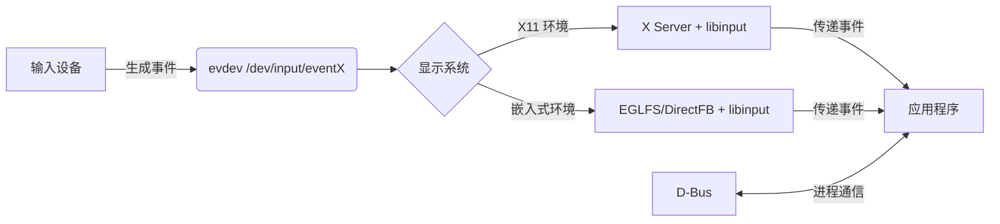

以下是 Linux 系统中与图形显示、输入处理和进程通信相关的关键组件详解：

---

### **1. 图形显示系统**
| **名称**     | **类型**       | **描述**                                                                 |
|--------------|----------------|--------------------------------------------------------------------------|
| **X11**      | 显示服务器     | 传统 Linux 桌面图形系统，提供网络透明的窗口管理（如 GNOME/KDE 的底层）       |
| **EGLFS**    | Qt 显示插件    | Qt 框架的嵌入式全屏后端，直接通过 EGL/OpenGL ES 渲染（无窗口系统，适合嵌入式） |
| **DirectFB** | 图形库         | 轻量级图形中间件，提供硬件加速绘图（常用于机顶盒、嵌入式视频播放）           |
| **linuxfb**  | 内核级显示     | 直接写入 Linux 帧缓冲（`/dev/fb0`），无硬件加速（简单嵌入式设备使用）       |

---

### **2. 输入处理系统**
| **名称**       | **层级**       | **描述**                                                                 |
|----------------|----------------|--------------------------------------------------------------------------|
| **evdev**      | 内核接口       | 原始输入设备驱动（`/dev/input/event*`），提供鼠标/键盘/触摸板的裸数据      |
| **libinput**   | 用户空间库     | 现代输入处理标准库（Wayland/X11 通用），支持手势识别、触摸板优化等         |

---

### **3. 进程通信机制**
| **名称**       | **作用**                     | **关键特性**                                                  |
|----------------|------------------------------|-------------------------------------------------------------|
| **D-Bus**      | 进程间通信 (IPC)             | 桌面环境的消息总线（应用通信、系统服务调用、设备事件通知等）       |

---

### **典型工作流示例**


---

### **技术对比**
| **场景**         | **推荐方案**              | **原因**                                     |
|------------------|--------------------------|---------------------------------------------|
| 传统桌面         | X11 + libinput + D-Bus   | 完整的桌面环境兼容性                         |
| 嵌入式带 GPU     | EGLFS + libinput         | 直接 GPU 渲染，无窗口系统开销                |
| 资源受限嵌入式   | linuxfb + evdev          | 无额外依赖，直接操作帧缓冲                   |
| 视频播放器       | DirectFB + libinput      | 硬件加速视频解码 + 轻量输入                 |

---

### **常见组合**
1. **桌面环境**
   `X11` (显示) + `libinput` (输入) + `D-Bus` (服务通信)

2. **汽车中控/HMI**
   `EGLFS` (OpenGL 渲染) + `libinput` (触摸手势) + `D-Bus` (车载服务通信)

3. **工业控制终端**
   `linuxfb` (直接写屏) + `evdev` (按键输入)

---

### **配置要点**
- **启用 libinput**（现代系统默认）：
  ```bash
  # Xorg 配置片段 (20-libinput.conf)
  Section "InputClass"
      Identifier "libinput"
      Driver "libinput"
  EndSection
  ```
- **切换 Qt 显示后端**：
  ```bash
  export QT_QPA_PLATFORM=eglfs       # 嵌入式全屏
  export QT_QPA_PLATFORM=xcb          # X11 桌面
  ```
- **D-Bus 调试**：
  ```bash
  dbus-monitor --system              # 监控系统级消息
  ```

> 💡 **提示**：现代 Linux 系统正转向 **Wayland**（替代 X11）+ **libinput** + **PipeWire**（多媒体）的新架构，但上述组件仍在广泛使用。