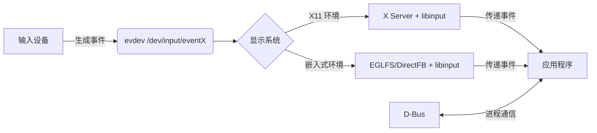

这些术语都是 **Linux 系统下图形显示和渲染相关的技术或框架**，主要应用于嵌入式系统、桌面环境以及图形应用程序（如 Qt 应用）的显示后端。以下是它们的详细解释：

---

### 1. **`DirectFB` (Direct Frame Buffer)**
- **定位**：轻量级硬件图形加速库（**无 X 窗口系统依赖**）。
- **功能**：
  - 直接操作帧缓冲区（`/dev/fbX`），提供 2D 图形加速（如矩形填充、位块传输）。
  - 支持输入设备（触摸屏、键盘）和层叠显示（多层合成）。
- **适用场景**：
  - 资源受限的嵌入式设备（如机顶盒、工控屏）。
  - 替代 X11 实现快速启动的图形界面。

---

### 2. **`EGLFS` (EGL Full Screen)**
- **定位**：**Qt 框架的显示后端**（基于 EGL 和 OpenGL ES）。
- **功能**：
  - 全屏独占显示，绕过窗口管理器直接渲染到帧缓冲区。
  - 依赖 **EGL**（用于 OpenGL 上下文管理）和 **GPU 驱动**（如 Mesa）。
- **要求**：
  - 必须支持硬件加速（GPU 或 VPU）。
  - 需要 **GBM (Generic Buffer Management)** 或 **DMA-BUF** 等底层接口。
- **典型用例**：
  - Qt Quick 应用在嵌入式 Linux（如 i.MX6 带 GPU 的型号）上运行。

---

### 3. **`GBM` (Generic Buffer Management)**
- **定位**：**Linux DRM/KMS 的底层内存管理 API**。
- **功能**：
  - 统一管理显存缓冲区（Buffer），为 EGL/OpenGL 提供 GPU 可识别的内存对象。
  - 是 **Mesa 3D 图形库的核心组件**。
- **作用**：
  - 桥接 **DRM/KMS**（内核图形驱动）和 **EGL**（用户态图形 API）。
  - 实现零拷贝纹理传输（如摄像头数据直接渲染）。

---

### 4. **`KMS` (Kernel Mode Setting)**
- **定位**：**Linux 内核的显示控制子系统**（属于 DRM 框架）。
- **功能**：
  - 管理显示模式（分辨率、刷新率）、多屏输出（HDMI/LVDS）和图层合成。
  - 替代传统 `fbdev` 框架，提供原子化提交（避免闪烁）。
- **用户态接口**：通过 **libdrm** 库调用。
- **重要性**：
  - 现代 Linux 图形栈的基础（如 Wayland、嵌入式 GUI）。

---

### 5. **`LinuxFB` (Linux Frame Buffer)**
- **定位**：**Qt 的纯软件渲染后端**（无 GPU 加速）。
- **原理**：
  - 直接写入帧缓冲区（`/dev/fb0`），通过 CPU 绘制图形（无硬件加速）。
- **优点**：
  - 兼容性极强（任何有 `fbdev` 驱动的设备均可使用）。
  - 资源占用低。
- **缺点**：
  - 性能差（复杂 UI 或视频易卡顿）。
  - 不支持透明度、3D 等高级特效。
- **适用场景**：
  - 无 GPU 的低端嵌入式设备（如 i.MX6ULL 运行 Qt 界面）。

---

### 6. **`XCB` (X Protocol C-language Binding)**
- **定位**：**X Window 系统的轻量级 C 语言接口库**（替代旧版 Xlib）。
- **功能**：
  - 与 X Server 通信，实现窗口创建、事件处理、图形绘制。
  - 更高效、更模块化（相比 Xlib）。
- **关联技术**：
  - 依赖 **X11 协议**和 **X Server**（如 Xorg）。
- **典型应用**：
  - Linux 桌面环境（GNOME/KDE）的底层通信。
  - Qt 的 `xcb` 后端（在 X11 环境下运行）。

---

### 总结对比表
| **技术**    | **类型**        | **依赖**               | **硬件加速** | **典型应用场景**               |
|-------------|-----------------|------------------------|--------------|--------------------------------|
| **DirectFB** | 图形库          | 帧缓冲区 (`/dev/fbX`)  | 可选 2D 加速 | 嵌入式轻量 UI                  |
| **EGLFS**    | Qt 后端         | EGL + GPU 驱动         | **必需**     | Qt Quick 全屏应用 (带 GPU)     |
| **GBM**      | 显存管理 API    | DRM/KMS 内核驱动       | 必需         | Mesa/EGL 的底层桥梁            |
| **KMS**      | 内核子系统      | DRM 驱动               | 支持         | 显示模式设置与多屏管理         |
| **LinuxFB**  | Qt 后端         | 帧缓冲区 (`/dev/fb0`)  | **不支持**   | 无 GPU 的嵌入式设备 (如 i.MX6ULL) |
| **XCB**      | X11 通信库      | X Server               | 可选         | 传统 Linux 桌面应用            |
| **X11**      | 显示服务器     | 传统 Linux 桌面图形系统，提供网络透明的窗口管理（如 GNOME/KDE 的底层）       |

---

### 在嵌入式开发中的选择建议：
1. **无 GPU 设备**（如 i.MX6ULL）：
   → 优先使用 **`LinuxFB`**（简单稳定）或 **`DirectFB`**（稍高性能的 2D 加速）。
2. **带 GPU 设备**（如 i.MX6Q）：
   → 使用 **`EGLFS` + `GBM/KMS`** 实现硬件加速渲染。
3. **传统桌面应用**：
   → 基于 **`XCB`** 在 X11 环境下运行。

---

### **2. 输入处理系统**
| **名称**       | **层级**       | **描述**                                                                 |
|----------------|----------------|--------------------------------------------------------------------------|
| **evdev**      | 内核接口       | 原始输入设备驱动（`/dev/input/event*`），提供鼠标/键盘/触摸板的裸数据      |
| **libinput**   | 用户空间库     | 现代输入处理标准库（Wayland/X11 通用），支持手势识别、触摸板优化等         |

---

### **3. 进程通信机制**
| **名称**       | **作用**                     | **关键特性**                                                  |
|----------------|------------------------------|-------------------------------------------------------------|
| **D-Bus**      | 进程间通信 (IPC)             | 桌面环境的消息总线（应用通信、系统服务调用、设备事件通知等）       |

---

### **典型工作流示例**


---

### **技术对比**
| **场景**         | **推荐方案**              | **原因**                                     |
|------------------|--------------------------|---------------------------------------------|
| 传统桌面         | X11 + libinput + D-Bus   | 完整的桌面环境兼容性                         |
| 嵌入式带 GPU     | EGLFS + libinput         | 直接 GPU 渲染，无窗口系统开销                |
| 资源受限嵌入式   | linuxfb + evdev          | 无额外依赖，直接操作帧缓冲                   |
| 视频播放器       | DirectFB + libinput      | 硬件加速视频解码 + 轻量输入                 |

---

### **常见组合**
1. **桌面环境**
   `X11` (显示) + `libinput` (输入) + `D-Bus` (服务通信)

2. **汽车中控/HMI**
   `EGLFS` (OpenGL 渲染) + `libinput` (触摸手势) + `D-Bus` (车载服务通信)

3. **工业控制终端**
   `linuxfb` (直接写屏) + `evdev` (按键输入)

---

### **配置要点**
- **启用 libinput**（现代系统默认）：
  ```bash
  # Xorg 配置片段 (20-libinput.conf)
  Section "InputClass"
      Identifier "libinput"
      Driver "libinput"
  EndSection
  ```
- **切换 Qt 显示后端**：
  ```bash
  export QT_QPA_PLATFORM=eglfs       # 嵌入式全屏
  export QT_QPA_PLATFORM=xcb          # X11 桌面
  ```
- **D-Bus 调试**：
  ```bash
  dbus-monitor --system              # 监控系统级消息
  ```

> 💡 **提示**：现代 Linux 系统正转向 **Wayland**（替代 X11）+ **libinput** + **PipeWire**（多媒体）的新架构，但上述组件仍在广泛使用。

`libinput` 和 `tslib` 是 Linux 系统（尤其是嵌入式环境）中处理输入设备的两种核心技术，它们在架构、适用场景和工作原理上有显著差异。以下是综合对比与分析：

---

### 📊 **1. 架构与设计理念**
| **组件**       | **设计目标**                  | **核心特性**                                                                 | **依赖关系**                          |
|----------------|-----------------------------|-----------------------------------------------------------------------------|---------------------------------------|
| **`libinput`** | 统一化现代输入处理            | 支持多种设备（触摸屏、鼠标、键盘、触控板），集成手势识别、手掌抑制等高级功能 。 | 依赖 `libudev` 和 `xkbcommon`（键盘支持）。 |
| **`tslib`**    | 专为电阻屏优化                | 模块化插件链（如 `linear` 校准、`dejitter` 去抖动），提供原始数据过滤和校准 。 | 无严格依赖，可独立运行。              |

---

### ⚙️ **2. 输入处理能力对比**
- **触摸支持**：
  - **`libinput`**：
    原生支持 **Linux 多点触控协议**，直接生成 `QTouchEvent` 事件，适合电容屏等现代触摸设备 。
  - **`tslib`**：
    仅支持**单点触控**，通过插件链处理原始数据后生成鼠标事件（如 `QMouseEvent`），适合电阻屏校准 。
- **校准需求**：
  - `tslib` 必须通过 **`ts_calibrate`** 五点校准生成 `pointercal` 文件 。
  - `libinput` 通常无需手动校准，依赖设备自身精度。

---

### ⚡ **3. 性能与适用场景**
| **场景**               | **推荐技术** | **原因**                                                                 |
|------------------------|-------------|--------------------------------------------------------------------------|
| **电容屏（多点触控）**  | `libinput`  | 原生支持多点触控，延迟低，集成手势识别 。          |
| **电阻屏（工业设备）**  | `tslib`     | 插件链可过滤抖动/噪声（如 `variance` 去噪、`median` 中值滤波）。 |
| **无 GPU 的嵌入式设备** | `tslib`     | 轻量级，无硬件加速依赖，适合 `linuxfb` 帧缓冲后端 。 |

---

### 🔧 **4. Qt 集成方式**
- **启用方法**：
  - **`libinput`**：
    Qt 默认启用，需确保开发文件存在。禁用需设置 `QT_QPA_EGLFS_NO_LIBINPUT=1` 。
  - **`tslib`**：
    需显式设置环境变量：
    ```bash
    # EGLFS 显示后端
    export QT_QPA_EGLFS_TSLIB=1
    # LinuxFB 显示后端
    export QT_QPA_FB_TSLIB=1
    export TSLIB_TSDEVICE=/dev/input/event0  # 指定设备节点
    ```
- **坐标调整**：
  `tslib` 可通过 `rotate` 参数旋转坐标（如 `rotate=180`），或通过 `linear` 插件仿射变换 。

---

### 🧩 **5. 高级功能扩展**
- **`libinput` 优势**：
  - **热插拔支持**：通过 `libudev` 动态检测设备插拔 。
  - **键盘抓取**：通过 `grab=1` 参数独占输入设备，避免 tty 终端干扰 。
- **`tslib` 的灵活性**：
  - **自定义滤波链**：在 `ts.conf` 中配置插件顺序（如 `module_raw input → module variance`）。
  - **X11 集成**：通过 `xf86-input-tslib` 驱动替代 `libinput`，适配老旧电阻屏 。

---

### 💎 **总结：如何选择？**
1. **现代电容屏/多设备支持** → 选择 **`libinput`**：
   功能全面，维护活跃，适合 Qt Quick 应用 。
2. **电阻屏/高噪声环境** → 选择 **`tslib`**：
   精准校准与滤波能力是工业场景刚需 。
3. **混合场景**：
   可在 Qt 中同时启用两者（如 `libinput` 处理键盘 + `tslib` 处理触摸），但需避免设备冲突 。

> 📌 **提示**：调试输入设备时，设置 `QT_LOGGING_RULES=qt.qpa.input=true` 可查看设备加载详情 。

