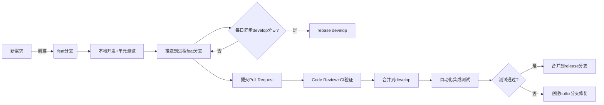

---

# Git代码开发与版本管理方案

## 一、分支管理策略
### 1. 核心分支定义
| 分支类型       | 命名规则      | 生命周期      | 保护级别 | 说明                              |
|----------------|---------------|---------------|----------|-----------------------------------|
| **main**       | `main`        | 永久          | 高       | 生产环境对应分支，仅接受Release合并 |
| **develop**    | `develop`     | 永久          | 中       | 集成测试分支，功能合并入口          |
| **feature**    | `feat/[JIRA-ID]-[desc]` | 临时 | 低       | 功能开发分支，例`feat/PROJ-123-add-login` |
| **hotfix**     | `hotfix/[ver]-[desc]` | 临时   | 中       | 紧急修复分支，例`hotfix/v1.2.1-login-bug` |
| **release**    | `release/[ver]` | 临时       | 高       | 版本发布分支，例`release/v1.3.0`      |

### 2. 开发流程规范


---

## 二、版本发布流程
### 1. 版本号规范（SemVer）
```
[主版本号].[次版本号].[修订号]-[预发布标签]
示例：v2.1.3-beta.1
规则：
- 主版本：不兼容性改动时递增
- 次版本：向下兼容的功能新增
- 修订号：向下兼容的Bug修复
- 预发布标签：alpha/beta/rc等阶段标识
```

### 2. 发布流程
1. **创建Release分支**
   ```bash
   git checkout -b release/v1.2.0 develop
   git push origin release/v1.2.0
   ```

2. **预发布验证**
   - 触发自动化测试流水线
   - 执行人工回归测试清单
   - 更新CHANGELOG.md文件

3. **版本封板**
   ```bash
   git tag -a v1.2.0 -m "Release version 1.2.0"
   git push origin v1.2.0
   ```

4. **合并到主分支**
   ```bash
   git checkout main
   git merge --no-ff release/v1.2.0
   git push origin main
   ```

5. **发布后清理**
   ```bash
   git branch -d release/v1.2.0
   git checkout develop
   git merge main
   ```

---

## 三、开发规范要求
### 1. 提交信息规范（Angular Commit）
```markdown
<type>[可选scope]: <简短描述>

[详细说明]

[可选footer]

示例：
fix(auth): 解决登录时Token过期问题

当用户登录凭证超过24小时未刷新时，自动跳转到重新认证页面

Closes PROJ-123
```

**类型说明**：
- `feat`: 新功能
- `fix`: Bug修复
- `docs`: 文档变更
- `style`: 代码格式调整
- `refactor`: 重构代码
- `test`: 测试用例
- `chore`: 构建/工具变更

### 2. 代码审查标准
| 检查项           | 标准                          | 工具集成              |
|------------------|-------------------------------|-----------------------|
| 代码风格         | ESLint/Checkstyle规则通过      | 预提交钩子            |
| 测试覆盖率       | 新增代码≥80%                  | SonarQube             |
| 安全扫描         | 无CVE高风险漏洞                | Snyk/Dependabot       |
| 构建通过率       | 全部CI阶段通过                 | GitLab CI/Jenkins     |
| 文档完整性       | 更新API文档及CHANGELOG        | Swagger/MkDocs        |

---

## 四、自动化工具链集成
### 1. CI/CD流水线设计
```yaml
# .gitlab-ci.yml 示例
stages:
  - lint
  - build
  - test
  - deploy

unit-test:
  stage: test
  script:
    - npm run test:coverage
  artifacts:
    paths:
      - coverage/

security-scan:
  stage: test
  image: snyk/snyk:node
  script:
    - snyk test --severity-threshold=high

deploy-prod:
  stage: deploy
  only:
    - main
  script:
    - ansible-playbook deploy-prod.yml
```

### 2. 关键工具选型
| 类别       | 推荐工具                      | 作用                          |
|------------|-------------------------------|-------------------------------|
| 仓库管理   | GitLab CE                     | 代码托管+CI/CD                 |
| 代码扫描   | SonarQube                     | 代码质量门禁                    |
| 依赖管理   | Dependabot                    | 自动更新第三方库漏洞             |
| 制品仓库   | JFrog Artifactory             | 版本化存储编译产出物             |
| 文档生成   | MkDocs + Swagger UI           | 自动化API文档                   |

---

## 五、权限管理矩阵
| 角色         | 权限范围                      | 操作限制                      |
|--------------|-------------------------------|-------------------------------|
| 开发者       | feature分支                   | 禁止强制推送/删除主分支        |
| 维护者       | develop/release分支           | 可合并PR/创建标签              |
| 管理员       | main/production配置           | 部署生产环境/管理访问令牌       |

---
